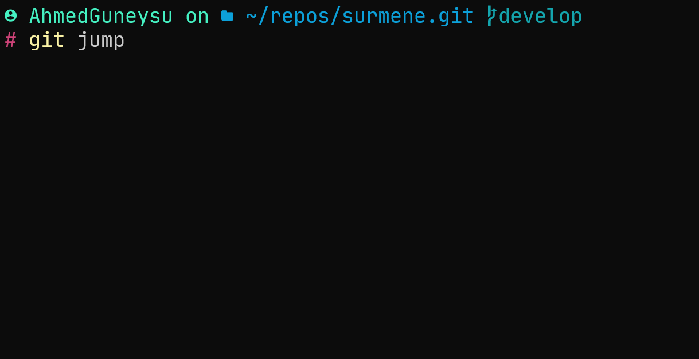

# git-jump

Jump between git branches using your keyboard up/down arrow keys.


## Installation

```ps
dotnet tool install `
  -g GitJump `
  --version 0.0.6 `
  --add-source https://www.myget.org/F/guneysu/api/v3/index.json
```

## Usage

```
$ git jump
> * develop
    master
    releases/v1.4.0
    releases/v1.4.1
    releases/v1.5.0
    releases/v1.6.0
    releases/v1.7.0
```


